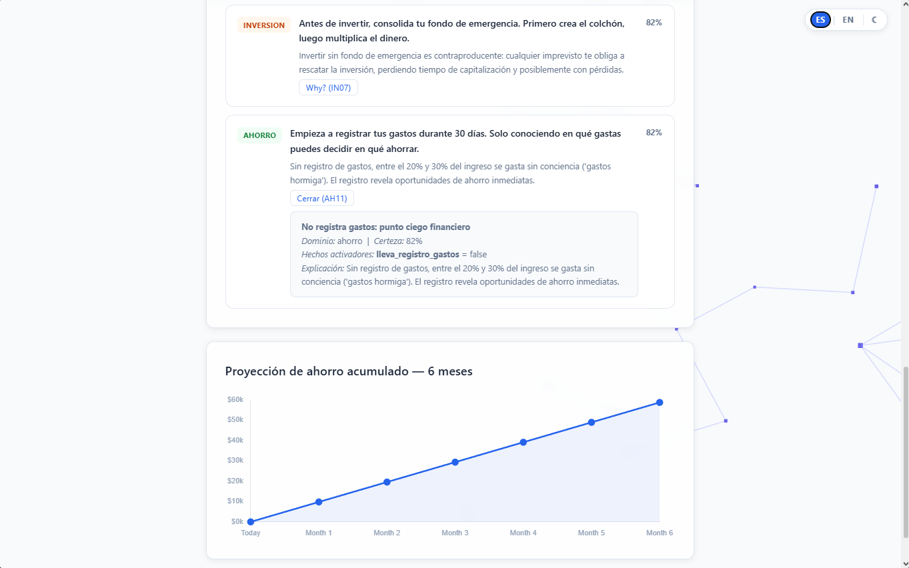

# MARA — Monitor y Asesor de Finanzas Personales y Ahorro

**MARA** es un Sistema Basado en Conocimiento (SBC) de encadenamiento hacia adelante que diagnostica la salud financiera personal de un usuario mexicano y genera recomendaciones personalizadas, priorizadas y explicables.

Desarrollado como proyecto académico en la **UAEH – ICBI**.
Autores: **Mario Ávila** · **Eduardo Figueroa**




---

## Características

- Motor de inferencia RETE simplificado (ciclo Match → Select → Execute)
- 80 reglas de producción en 6 dominios: diagnóstico, deuda, ahorro, perfil de riesgo, inversión y pronóstico
- Resolución de conflictos por prioridad → especificidad → factor de certeza
- Explicabilidad: panel "¿Por qué?" que expone la cadena de razonamiento
- API REST Flask (`/diagnose`, `/explain`, `/health`) con validación de entradas en backend
- Frontend wizard de 4 pasos con semáforo financiero y gráfica de proyección a 6 meses
- Modo oscuro / claro con persistencia en `localStorage`
- Internacionalización ES / EN en la interfaz (la base de conocimiento permanece en español)
- Validación de formulario en frontend (rangos y tipos) y en backend (400 con mensaje descriptivo)
- 152 pruebas automatizadas (unitarias + integración)
- Base de conocimiento sustentada en estándares CONDUSEF / CNBV / Banxico / ENIF 2021

---

## Arquitectura

```
finexpert/
├── backend/
│   ├── app.py                   ← Flask: /diagnose, /explain, /health + validación de inputs
│   ├── config.py                ← Variables de entorno
│   ├── engine/
│   │   ├── inference_engine.py  ← Ciclo Match-Select-Execute
│   │   ├── working_memory.py    ← Hechos de la sesión activa
│   │   ├── agenda.py            ← Fase MATCH + selección
│   │   ├── conflict_resolver.py ← Prioridad → especificidad → certeza
│   │   └── explainer.py         ← Trazabilidad en lenguaje natural
│   ├── knowledge/
│   │   ├── knowledge_base.py    ← Cargador y validador de reglas JSON
│   │   ├── fact_base.py         ← Umbrales CONDUSEF/CNBV/Banxico
│   │   ├── rules/               ← 80 reglas en 6 archivos JSON
│   │   └── ontology/            ← Conceptos y umbrales del dominio
│   ├── models/
│   │   ├── user_profile.py      ← UserProfile + Diagnosis + Recommendation
│   │   └── rule.py              ← Rule + Condition (dataclasses)
│   └── utils/
│       ├── calculators.py       ← Funciones financieras puras
│       ├── validators.py        ← Validación de rangos y tipos (llamada desde app.py)
│       └── logger.py            ← Configuración de logging
├── frontend/
│   ├── index.html               ← SPA: wizard 4 pasos + dashboard, atributos data-i18n
│   ├── assets/
│   │   ├── css/
│   │   │   ├── main.css         ← Variables CSS, dark mode ([data-theme="dark"]), barra de controles
│   │   │   ├── wizard.css       ← Progreso, pasos, secciones
│   │   │   └── dashboard.css    ← Semáforo, métricas, recomendaciones, dark mode overrides
│   │   ├── js/
│   │   │   ├── theme.js         ← Toggle claro/oscuro, persistencia en localStorage
│   │   │   ├── i18n.js          ← Traducciones ES/EN, applyTranslations(), persistencia
│   │   │   ├── api.js           ← fetchDiagnosis(), fetchExplain(), checkHealth()
│   │   │   ├── wizard.js        ← Navegación, validación por paso, buildProfile()
│   │   │   ├── dashboard.js     ← renderDashboard(), métricas y situación con i18n
│   │   │   ├── charts.js        ← Gráfica Chart.js con colores adaptados al tema activo
│   │   │   └── explainer.js     ← Panel "¿Por qué?" por regla
│   │   └── img/
│   │       └── logo.svg         ← Logo vectorial minimalista (polyline + circle)
└── tests/
    ├── unit/                    ← 9 archivos de pruebas unitarias
    └── integration/             ← 6 archivos de pruebas de integración
```

### Flujo de inferencia

```
UserProfile → to_initial_facts() → WorkingMemory
                                       ↓
                    ┌──────────────────────────────┐
                    │  Ciclo Match-Select-Execute   │
                    │  ┌────────────────────────┐   │
                    │  │ MATCH: evalúa IF de    │   │
                    │  │ todas las reglas       │   │
                    │  └──────────┬─────────────┘   │
                    │             ↓                  │
                    │  ┌────────────────────────┐   │
                    │  │ SELECT: ConflictResolver│   │
                    │  │ (prio → espec → cert)  │   │
                    │  └──────────┬─────────────┘   │
                    │             ↓                  │
                    │  ┌────────────────────────┐   │
                    │  │ EXECUTE: assert_fact() │   │
                    │  │ + Explainer.record()   │   │
                    │  └────────────────────────┘   │
                    └──────────────────────────────┘
                                       ↓
                                  Diagnosis
                    (situacion, semaforo, certeza,
                     recomendaciones, proyeccion_6m,
                     cadena_inferencia)
```

---

## Reglas de producción

| Dominio         | Reglas | Ejemplos de hechos derivados                                       |
|-----------------|--------|--------------------------------------------------------------------|
| `diagnostico`   | 20     | `situacion`, `alerta_DAI_alto`, `alerta_tasa_usuraria`             |
| `deuda`         | 15     | `nivel_endeudamiento`, `estrategia_deuda`, `accion_urgente_deuda`  |
| `ahorro`        | 15     | `nivel_fondo_emergencia`, `nivel_ahorro`, `urgencia_fondo_emergencia` |
| `perfil_riesgo` | 10     | `perfil_riesgo`, `tolerancia_riesgo`, `puede_invertir_renta_variable` |
| `inversion`     | 10     | `instrumento`, `recomendacion_diversificar_portafolio`             |
| `pronostico`    | 10     | `pronostico_6m`, `urgencia_intervencion`, `alerta_riesgo_insolvencia` |

Todos los umbrales están basados en estándares CONDUSEF/CNBV/Banxico y la Encuesta Nacional de Inclusión Financiera (ENIF) 2021.

---

## Instalación y ejecución

### Requisitos
- Python 3.11+
- Navegador moderno (para el frontend)

### Backend

```bash
cd finexpert/backend
pip install -r requirements.txt
python app.py
# Servidor en http://localhost:5000
```

### Frontend

Abrir `finexpert/frontend/index.html` en el navegador.
El frontend llama al backend en `http://localhost:5000` por defecto.

### Variables de entorno (opcionales)

| Variable       | Default | Descripción                      |
|----------------|---------|----------------------------------|
| `FLASK_PORT`   | `5000`  | Puerto del servidor Flask        |
| `FLASK_DEBUG`  | `false` | Modo debug de Flask              |
| `LOG_LEVEL`    | `INFO`  | Nivel de logging                 |
| `CORS_ORIGINS` | `*`     | Orígenes CORS permitidos         |

---

## API REST

### `GET /health`
```json
{ "status": "ok", "sistema": "MARA", "reglas_cargadas": 80 }
```

### `POST /diagnose`
**Body:** perfil del usuario (ver campos en `models/user_profile.py`)

**Campos requeridos:** `ingreso_mensual`, `gastos_fijos`, `gastos_variables`

El backend valida rangos antes de ejecutar el motor (edad 18–99, tasa 0–200, etc.) y devuelve `400` con mensaje descriptivo si hay error.

**Respuesta:**
```json
{
  "situacion": "en_riesgo",
  "nivel_certeza": 82,
  "semaforo": "amarillo",
  "recomendaciones": [...],
  "hechos_derivados": {...},
  "cadena_inferencia": [...],
  "proyeccion_6m": [0, 1100, 2200, 3300, 4400, 5500, 6600]
}
```

### `POST /explain`
```json
{
  "perfil": { ...campos igual que /diagnose... },
  "regla": "D03"
}
```

---

## Validación de entradas

La validación ocurre en dos capas:

**Frontend (`wizard.js`)** — antes de avanzar cada paso:

| Paso | Campo                  | Regla                        |
|------|------------------------|------------------------------|
| 1    | `edad`                 | Entero, 18–99                |
| 1    | `num_dependientes`     | 0–10                         |
| 2    | `ingreso_mensual`      | > 0                          |
| 2    | `gastos_fijos/variables` | ≥ 0                        |
| 2    | `tasa_promedio_anual`  | 0–200 %                      |
| 3    | `horizonte_temporal`   | Entero, 1–600 meses          |
| 3    | `meses_fondo_emergencia` | 0–36 meses                 |

**Backend (`validators.py` → `app.py`)** — en cada llamada a `/diagnose` y `/explain`:
- Campos requeridos presentes y no negativos
- Edad 18–99 si se proporciona
- Tasa de interés en rango válido

Los mensajes de error del frontend están disponibles en ES y EN.

---

## Interfaz de usuario

### Modo oscuro / claro

El toggle `☾/☀` en la barra de controles (esquina superior derecha) alterna entre temas.
La preferencia se persiste en `localStorage` y se aplica antes de renderizar la página para evitar flash de tema incorrecto.

El tema oscuro se implementa con variables CSS bajo `[data-theme="dark"]` en `main.css` y `dashboard.css`, sin duplicar clases.

### Internacionalización (ES / EN)

El botón `ES | EN` en la barra de controles cambia el idioma de toda la interfaz.
La preferencia se persiste en `localStorage`.

- Los textos del DOM se traducen mediante atributos `data-i18n`, `data-i18n-ph` (placeholders) y `data-i18n-title` (tooltips).
- La base de conocimiento y las recomendaciones generadas por el motor permanecen siempre en español.
- En modo EN se muestra una nota informativa en el dashboard indicando este comportamiento.

---

## Pruebas

```bash
cd finexpert
pytest                    # todos los tests
pytest tests/unit/        # solo unitarios
pytest tests/integration/ # solo integración
pytest --cov=backend      # con cobertura
```

```
152 passed  (0.33s)
```

---

## Semáforo financiero

| Color    | Situación            | Condición característica                  |
|----------|----------------------|-------------------------------------------|
| Rojo     | Crítica / Extrema    | ratio_gasto_fijo > 70 % o DAI > 50 %     |
| Amarillo | En riesgo / Moderada | ahorro < 10 % o gastos fijos 50–70 %     |
| Verde    | Saludable            | gastos fijos ≤ 50 % y ahorro ≥ 20 %      |
| Gris     | Sin datos            | Información insuficiente                  |

